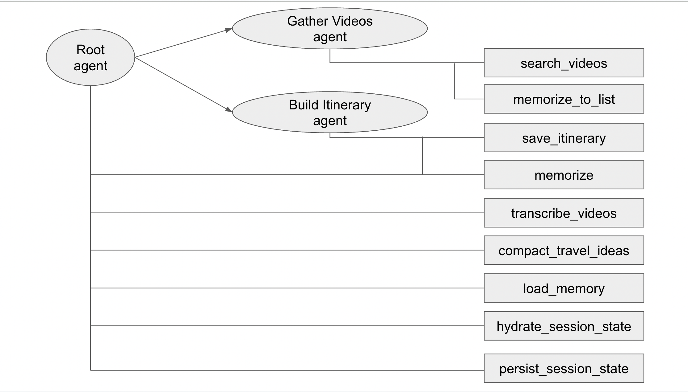
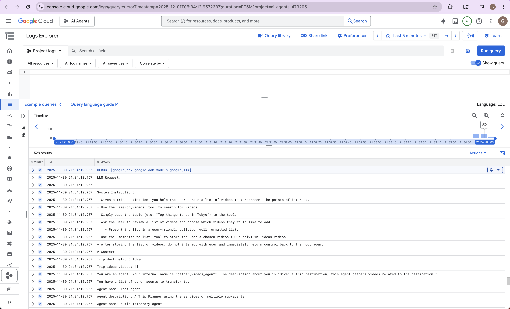
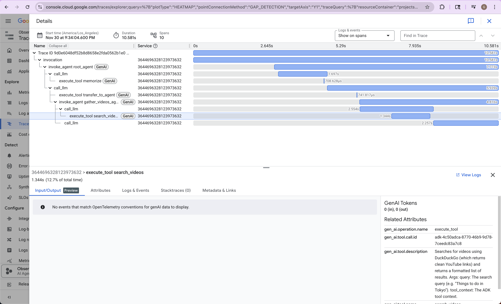
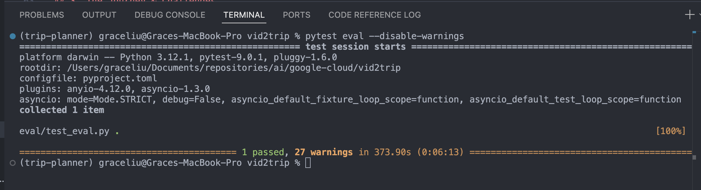
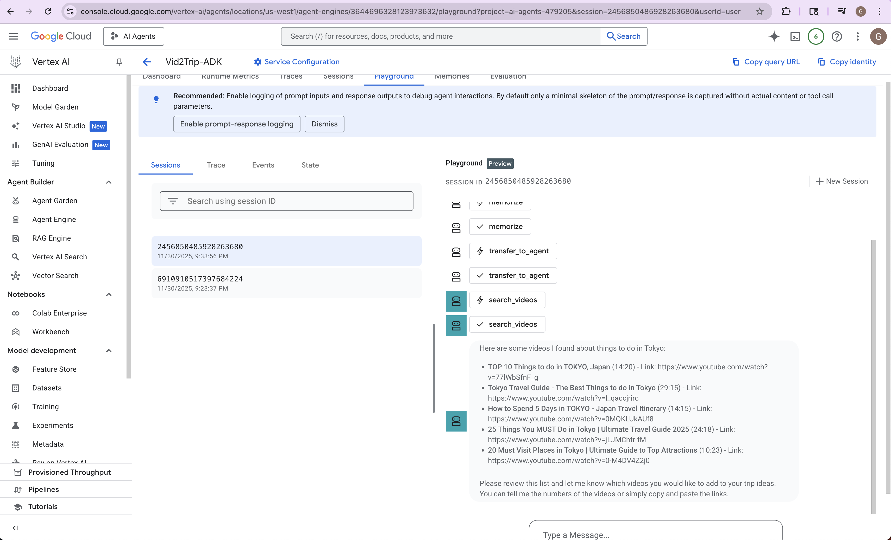

This project is Grace Liu's Capstone Project for the 2025 Kaggle AI Agents Intensive Course.

# Vid2Trip: Turning Watch Time into Travel Plans

**Vid2Trip** is an intelligent Multi-Agent System (MAS) that transforms passive travel inspiration into actionable itineraries. By leveraging Google’s Agent Development Kit (ADK) and Gemini 2.5 Flash, it bridges the gap between unstructured video content and structured travel planning.

## 1. The Pitch

### Problem Statement: The Format Friction
Video platforms like YouTube are the primary source of travel inspiration for millions. However, converting a 20-minute vlog into a usable plan is a friction-heavy process.
* **Linear vs. Structured:** Video is linear and temporal; itineraries are spatial and structured.
* **Information Overload:** Extracting specific restaurant names, locations, and tips requires pausing, rewinding, and manual note-taking.
* **Fragmentation:** Users often want to mix-and-match recommendations from multiple creators, making manual synchronization difficult.

### Solution & Core Value
Vid2Trip is not just a transcriber; it is a **reasoning engine**. It employs a team of specialized AI agents to watch, read, and organize travel data on behalf of the user.
* **Agentic Workflow:** Instead of a static script, the system uses agents that can handle ambiguity—searching for videos, filtering for relevance, and negotiating the final plan with the user.
* **Value Proposition:** We reduce hours of research into minutes of processing. The user provides the *intent* ("I want a trip to Tokyo based on food vlogs"), and the agents handle the *execution* (Finding videos, extracting POIs, and scheduling them).

---

## 2. The Implementation

### Architecture
The system utilizes a **Hierarchical Multi-Agent Architecture** orchestrated by a Root Agent. This ensures separation of concerns, where each agent utilizes specific tools and context to perform a distinct role.



**The Agentic Workflow:**

**1. `root_agent` (The Orchestrator)**
Acts as the state machine. It manages the global context (`destination`, `videos`, `itinerary`) and determines which specialist agent needs to be active based on the current state of the memory. It handles the hand-offs between gathering, processing, and planning.

**2. `gather_videos_agent` (The Researcher)**
* **Role:** Identifies high-quality source material.
* **Logic:** We implemented a specific "Human-in-the-Loop" design here. Rather than the agent blindly picking videos, it presents a curated list to the user and pauses execution. This required careful state management to ensure the `ideas_videos` list wasn't populated until the user explicitly confirmed their selection, preventing downstream agents from processing irrelevant content.
* **Tooling:** Uses a custom `video_search_tool` powered by DuckDuckGo to bypass standard SEO clutter and find actual vlogs, cleaning and validating links to prevent hallucinations.

**3. Intelligent Ingestion Layer (The Transcriber)**
* **Role:** Converts video audio into structured text.
* **Architectural Decision:** We deliberately implemented this as a **deterministic Tool** rather than a conversational Agent. Since the goal is high-throughput batch processing of video data using `yt-dlp`, a Python-native approach ensures zero-latency execution and prevents LLM "chat loops." This design choice optimizes for reliability, ensuring the downstream **Planner Agent** receives clean, complete data every time.
* **Future Work:** We plan to introduce a "Curator Agent" at this stage to interactively filter the content before transcription.

**4. `build_itinerary_agent` (The Planner)**
* **Role:** Synthesizes raw text into a schedule.
* **Logic:** The prompt engineering for this agent was critical. We used a "Chain of Thought" approach where the agent first summarizes the transcripts in its internal monologue before drafting the schedule. Furthermore, we explicitly restricted the agent from writing Python wrappers in its final output, forcing it to strictly adhere to the Pydantic schema required by the `save_itinerary` tool.

### Technical Features & Stack
* **Multi-agent System:** Using Google Agent Development Kit (ADK) for state management and routing.
* **Model:** Gemini 2.5 Flash for high-speed, low-latency reasoning.
* **State Management:**
    * **Session-Scoped Memory:** Utilized `tool_context.state` to pass complex objects (video lists, full itinerary JSON) between agents.
    * **Persistence:** Custom `memorize` and `memorize_to_list` tools allow agents to "commit" facts to long-term memory.
* **Tooling Strategy:**
    * **Robustness:** Implemented fallback logic for YouTube scraping (handling 429 errors and soft blocks).
    * **Type Safety:** Tools utilize Pydantic models to enforce strict schema compliance, preventing the LLM from generating malformed JSON.
* **Observability:** Logging with configurable log level and tracing using Google Cloud tracing


* **Agent Evaluation & Testing:** Implemented a robust regression testing suite using `pytest` and the ADK's `AgentEvaluator`. We defined "Golden Path" scenarios with custom semantic thresholds (via `test_config.json`) to ensure the agent reliably produces valid JSON itineraries without regression.

* **Deployment:** Fully deployed via `deploy.py` using a `uv` managed environment for reproducible builds.


---

## 3. The Journey & Challenges

Building Vid2Trip required overcoming several challenges:

1.  **Hallucinations in Search:** Initially, the generic Google Search tool returned blog posts instead of videos, or hallucinated broken YouTube URLs. We engineered a specific `Youtube_tool` that validates link structure and ensures only playable content is passed to the pipeline.
2.  **Platform Blocking:** The transcription agent initially faced soft-blocks from YouTube (`list_transcripts` failures). We refactored the tool to use `yt-dlp` with temporary file handling to robustly extract auto-generated captions without triggering anti-bot measures.
3.  **Structured Output:** The itinerary builder initially struggled to produce consistent JSON while maintaining a natural conversation. We solved this by implementing a **"Tool-as-Schema"** pattern. We injected the raw JSON schema into the tool's docstring and explicitly instructed the model *not* to generate Python code wrappers, solving the "Malformed Function Call" errors we encountered during testing.

---

## 4. Future Work

* **Multimodal Analysis:** Upgrade the `transcribe_agent` to use Gemini 1.5 Pro's native video ingestion to "see" visuals (e.g., reading menu prices or spotting scenic views) that aren't spoken in the audio.
* **Geo-Spatial Routing:** Integrate the Google Maps API to optimize the itinerary order based on actual travel times between the extracted locations.
* **Calendar Export:** Add a tool to push the finalized JSON directly to the user's Google Calendar.

---

## 5. Demo

[Link to YouTube video]

---

## 6. Setup and Installation

### Folder Structure
```
.
├── README.md
├── pyproject.toml
├── trip_planner/
│   ├── tools/
│   └── sub_agents/
│       ├── gather_videos_agent/
│       └── build_itinerary_agent/
└── eval/
└── deployment/
```

### Prerequisites

- Python 3.10+
- Google Cloud Project (for Vertex AI integration)
- Google Agent Development Kit 1.0+
- uv

### Installation

1.  Clone the repository:

    ```bash
    git clone https://github.com/graceliu/vid2trip.git
    ```

2.  Install dependencies:

    ```bash
    uv sync
    ```

3.  Set up environment variables:

    - Set the following environment variables in `.env` (copy from `.env.example`)
    ```
    # Use the Vertex AI Engine
    GOOGLE_GENAI_USE_VERTEXAI=1

    # Vertex backend config
    GOOGLE_CLOUD_PROJECT=__YOUR_CLOUD_PROJECT_ID__
    GOOGLE_CLOUD_LOCATION=__YOUR_CLOUD_LOCATION__

    # GCS Storage Bucket name - for Agent Engine deployment
    GOOGLE_CLOUD_STORAGE_BUCKET=__YOUR_BUCKET_NAME__

    # Sample Scenario Path - Default is the empty state
    TRIP_PLANNER_SCENARIO=trip_planner/scenarios/empty_default.json

    # log level
    LOG_LEVEL=INFO

4. Authenticate your GCloud account.
    ```bash
    gcloud auth application-default login
    ```

5. Activate the virtual environment set up by Poetry, run:
    ```bash
    eval $(poetry env activate)
    (trip-planner) $ # Virtualenv entered
    ```

---

## 7. Running the Agent

### Using `adk` locally

You may talk to the agent using its web interface:

```bash
adk web
```

This will start a local web server on your machine. You may open the URL, select "trip_planner" in the top-left drop-down menu, and a chatbot interface will appear on the right. 

Here is something to try: 
* "Help me plan a trip to Tokyo"

---

## 8. Running Evaluation

To run the evaluation, install the extra dependencies and run `pytest`:

```bash
uv sync --dev
pytest eval --disable-warnings
```


---

## 9. Deploying the Agent, Logging, and Cloud Trace

To deploy the agent to Vertex AI Agent Engine, run the following commands:

```bash
uv sync --group deployment
uv run python deployment/deploy.py --create
```
When this command returns, if it succeeds it will print an AgentEngine resource
id that looks something like this:
```
projects/************/locations/us-central1/reasoningEngines/7737333693403889664
```

To quickly test that the agent has successfully deployed,
run the following command for one turn with the agent "Please help me plan a trip to Tokyo":
```bash
uv run python deployment/deploy.py --quicktest --resource_id=<RESOURCE_ID>
```
This will return a stream of JSON payload indicating the deployed agent is functional.

To delete the agent, run the following command (using the resource ID returned previously):
```bash
uv run python deployment/deploy.py --delete --resource_id=<RESOURCE_ID>
```         

To view logs, go to:

https://console.cloud.google.com/logs/query?project=<GOOGLE_CLOUD_PROJECT>

To view cloud trace, go to:

https://console.cloud.google.com/traces/explorer?project=<GOOGLE_CLOUD_PROJECT>


---

## 10. Acknowledgements

This project is inspired by and based on code from https://github.com/google/adk-samples/tree/main/python/agents/travel-concierge.
